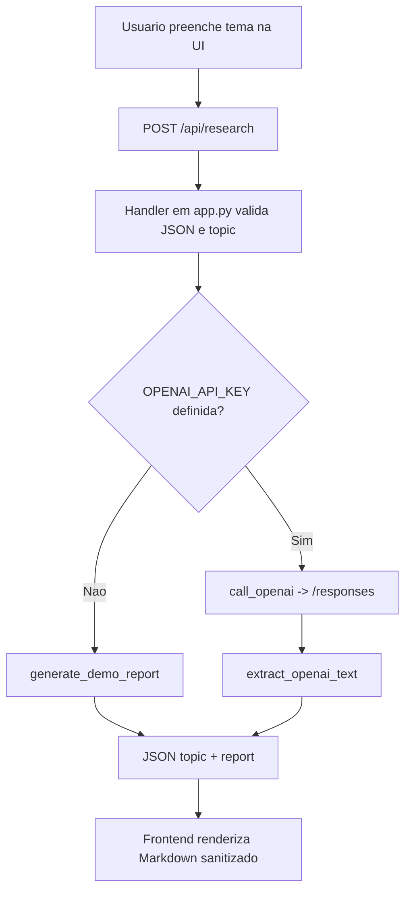

# Instruções para Copilot — pesquisador_especialista

## Comandos operacionais deste repositório

O projeto não possui `Makefile`, `pyproject.toml`, suíte de testes, lint ou build formal definidos no repositório.

### Executar aplicação

```bash
cp .env.example .env
uv run --env-file .env app.py
```

Alternativa sem `uv`:

```bash
python3 app.py
```

### Executar um teste único

Atualmente não há runner de testes automatizados configurado no repositório.  
Para validar uma execução específica, use teste manual da rota:

```bash
curl -sS -X POST http://127.0.0.1:8000/api/research \
  -H "Content-Type: application/json" \
  -d '{"topic":"ligas de aluminio com grafeno"}'
```

## Arquitetura (visão geral)

O projeto é uma aplicação web simples com backend Python (stdlib) e frontend estático:

1. `app.py` concentra servidor HTTP, roteamento, integração com OpenAI/Azure e geração de relatório.
2. `static/index.html` entrega UI única, envia `POST /api/research` e renderiza Markdown com `marked` + sanitização via `DOMPurify`.
3. `agent/prompt.md` define o prompt de sistema principal usado nas chamadas ao modelo.

### Fluxo principal



## Convenções específicas do código

### Backend e contrato HTTP

- Rotas esperadas:
  - `GET /` e `GET /index.html` servem a UI.
  - `POST /api/research` recebe `{"topic": "..."}`.
- Respostas:
  - Sucesso: `{"topic": "...", "report": "..."}`.
  - Erro de cliente: `400` com `{"error": "..."}`.
  - Erro de provedor IA: `502` com `{"error": "..."}`.

### Prompt e geração de conteúdo

- O prompt-base vem de `agent/prompt.md`; se ausente, há fallback hardcoded em `app.py`.
- A mensagem de usuário é montada por `build_user_prompt()` com estrutura obrigatória de seções e exigência de citações por link.
- Sem `OPENAI_API_KEY`, o sistema **sempre** entra em modo demonstração (`generate_demo_report`), mantendo o formato de saída.

### Integração OpenAI/Azure

- Endpoint chamado: `POST {OPENAI_BASE_URL}/responses`.
- OpenAI padrão usa header `Authorization: Bearer ...`.
- Azure (`.openai.azure.com`) usa header `api-key`.
- O parser `extract_openai_text()` aceita diferentes formatos de payload (`output_text`, `output[].content[]`, fallback estilo `choices`).

### Convenções da UI

- A UI normaliza citações no formato legado `[Fonte: url1; url2]` para links Markdown clicáveis.
- Todo HTML renderizado deve passar por sanitização (`DOMPurify`) antes de inserir no DOM.
- Links no resultado devem abrir em nova aba com `noopener noreferrer`.

### Configuração de execução

- Defaults locais definidos em código: `HOST=127.0.0.1` e `PORT=8000`.
- `.env.example` inclui variáveis de timeout/debug e modelo (`OPENAI_TIMEOUT_SECONDS`, `OPENAI_DEBUG`, `OPENAI_MODEL`).
