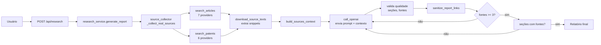

# Arquitetura

## Stack

| Camada | Tecnologia |
|---|---|
| Backend | Python 3.11+ (stdlib `http.server`) |
| Frontend | React 19 + TypeScript + Vite + Mantine 9 |
| IA | OpenAI-compatible API (Azure OpenAI suportado) |
| Banco | SQLite (`~/.pesquisador/history.db`) |
| HTTP Client | `urllib` padrão (sem `requests`) |

## Estrutura de diretórios

```
pesquisador_especialista/
├── app.py                       # Entry point (delega para server.app)
├── server/
│   ├── app.py                   # Inicializa servidor HTTP (ThreadingHTTPServer)
│   ├── config.py                # Configurações (.env, paths, prompts)
│   ├── handlers/
│   │   └── research_handler.py  # Rotas HTTP (GET, POST, DELETE)
│   ├── services/
│   │   ├── ai_service.py        # Chamada à OpenAI/Azure
│   │   ├── db.py                # SQLite (histórico de pesquisas)
│   │   ├── report_service.py    # Sanitização de links do relatório
│   │   ├── research_service.py  # Orquestração do pipeline
│   │   ├── source_collector.py  # Coleta de fontes em APIs gratuitas
│   │   └── source_service.py    # Validação de URLs e seções
│   ├── models/
│   │   ├── article.py           # Dataclass Article
│   │   └── patent.py            # Dataclass Patent
│   ├── prompts/
│   │   ├── systemprompt.md      # Persona do pesquisador IA
│   │   └── userprompt.md        # Template do prompt do usuário
│   ├── utils/
│   │   ├── http_client.py       # HTTP com retry, rate limiting
│   │   ├── fetcher.py           # Download PDF/HTML, snippets, validação
│   │   └── search/
│   │       ├── academic.py      # Busca artigos (7 providers)
│   │       ├── patents.py       # Busca patentes (6 providers)
│   │       ├── ieee.py          # Provider IEEE Xplore
│   │       ├── serpapi.py       # Google Scholar via SerpAPI
│   │       ├── serpapi_scholar.py
│   │       ├── serpapi_patents.py
│   │       ├── wipo.py          # WIPO Patentscope
│   │       └── prompt_enrichment.py  # Formata contexto para o LLM
│   └── tests/                   # Testes pytest
├── ui/
│   ├── src/
│   │   ├── App.tsx              # Componente principal
│   │   ├── main.tsx             # Entry point React
│   │   ├── theme.ts             # Tema Mantine (cores, fontes)
│   │   ├── types.ts             # Interfaces TypeScript
│   │   ├── helpers.ts           # Utilitários (normalização de links)
│   │   └── components/
│   │       ├── AppNavbar.tsx    # Barra lateral (navegação + histórico)
│   │       ├── EmptyState.tsx   # Estado vazio do resultado
│   │       ├── MarkdownRenderer.tsx  # Renderização Markdown
│   │       └── SvgIcon.tsx      # Ícone SVG inline
│   └── dist/                    # Build de produção
└── docs/                        # Documentação técnica
```

## Inventário de serviços

| Serviço | Arquivo | Responsabilidade | Dependências |
|---|---|---|---|
| HTTP Server | `server/app.py` | Inicializa `ThreadingHTTPServer` | `ResearchHandler` |
| Router | `handlers/research_handler.py` | Roteia GET/POST/DELETE | `db`, `research_service` |
| Pipeline | `services/research_service.py` | Orquestra coleta → IA → validação → sanitização | `ai_service`, `source_collector`, `report_service`, `source_service` |
| IA | `services/ai_service.py` | Chamada HTTP à OpenAI/Azure | `config` (prompts) |
| Fontes | `services/source_collector.py` | Coleta artigos + patentes em paralelo | `search/academic`, `search/patents`, `fetcher`, `prompt_enrichment` |
| Validação | `services/source_service.py` | Heurísticas de URL, seções, qualidade | — |
| Sanitização | `services/report_service.py` | Remove links inválidos do Markdown | `source_service`, `fetcher` |
| Banco | `services/db.py` | CRUD SQLite para histórico | — |
| Fetcher | `utils/fetcher.py` | Download, extração de texto, snippets | — |
| HTTP Client | `utils/http_client.py` | GET/POST com retry e backoff | — |

## Fluxo de geração de relatório



## Providers de busca

### Artigos (academic.py)

| Provider | Chave necessária | Ativo por padrão |
|---|---|---|
| Crossref | — | Sim |
| OpenAlex | — | Sim |
| arXiv | — | Sim |
| Core.ac.uk | `CORE_API_KEY` | Não |
| Semantic Scholar | `SEMANTIC_SCHOLAR_API_KEY` | Não |
| IEEE Xplore | `IEEE_API_KEY` | Não |
| Google Scholar | `SERPAPI_API_KEY` | Não |

### Patentes (patents.py)

| Provider | Chave necessária | Ativo por padrão |
|---|---|---|
| Espacenet OPS | `EPO_OPS_CONSUMER_KEY` + `SECRET` | Não |
| USPTO | `USPTO_API_KEY` | Não |
| Lens.org | `LENS_API_TOKEN` | Não |
| WIPO Patentscope | `WIPO_API_KEY` | Não |
| Google Patents | `SERPAPI_API_KEY` | Não |
| PatentsView | — | Sim (descontinuado) |

## Limites de coleta

| Constante | Valor | Efeito |
|---|---|---|
| `MAX_QUERY_VARIANTS` | 5 | Queries geradas por tópico |
| `ARTICLES_PER_QUERY` | 8 | Artigos buscados por query (antes da dedup) |
| `PATENTS_PER_QUERY` | 6 | Patentes buscadas por query (antes da dedup) |
| `DEFAULT_MAX_RESULTS` (academic) | 10 | Artigos finais após dedup |
| `DEFAULT_MAX_RESULTS` (patents) | 5 | Patentes finais após dedup |
| `PROVIDER_MULTIPLIER` | 2 | Cada provider busca `max_results × 2` |
