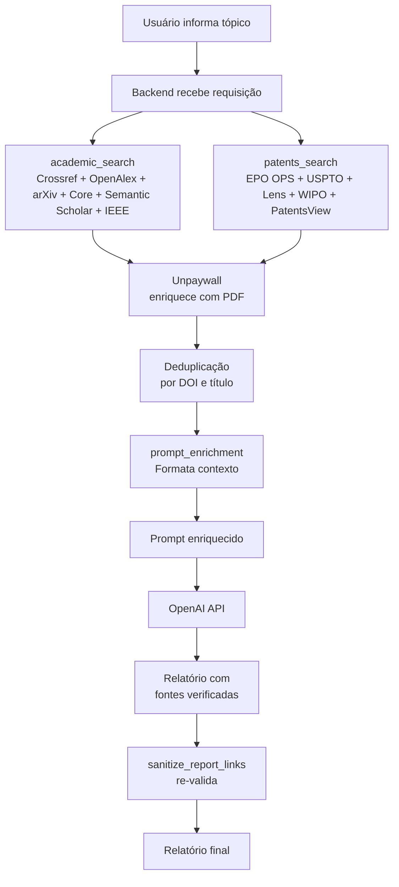

# Plano de Implementação — APIs Gratuitas de Busca

> Status: implementado
> Versão: 3.0
> Última atualização: 2026-06-15

## 1. Objetivo

Eliminar a alucinação de DOIs, números de patente e URLs no relatório gerado pelo agente. A estratégia é substituir a "memória" do modelo por **fontes reais** coletadas via APIs gratuitas antes da geração do relatório.

## 2. Contexto e motivação

Hoje o agente gera o relatório apenas com o prompt enviado à OpenAI. Sem ferramentas de busca, o modelo frequentemente inventa:

- DOIs que respondem 404 ou apontam para artigos sem relação com o tema
- Números de patente existentes, mas de outras áreas (ex.: US20180218158A1 sobre segurança de computadores, não sobre extrusoras)
- URLs de homepages de bases (ex.: `https://worldwide.espacenet.com`) em vez de páginas específicas

A sanitização atual (`utils/fetcher.py` + `app.py:sanitize_report_links`) detecta e remove links inválidos/irrelevantes, mas a solução definitiva é fornecer ao modelo fontes reais para citar.

## 3. APIs selecionadas e implementadas

### 3.1 Artigos acadêmicos

| API | Custo | Cadastro | Limites | Status |
|---|---|---|---|---|
| **Crossref** | Grátis | Não (recomenda user-agent com email) | Razoável para uso moderado | ✅ Implementado |
| **OpenAlex** | Grátis | Não (recomenda user-agent com email) | Polido (com `mailto` no user-agent) | ✅ Implementado |
| **arXiv** | Grátis | Não | Sem limite explícito | ✅ Implementado |
| **Core.ac.uk** | Grátis | Não | Generoso | ✅ Implementado |
| **Semantic Scholar** | Grátis (com chave opcional) | Sim (para chave; rate limit sem chave) | Sem chave: ~100 req/5min | ✅ Implementado |
| **IEEE Xplore** | Grátis | Sim (developer.ieee.org) | Header `apikey` | ✅ Implementado |
| **Unpaywall** | Grátis (com email) | Email próprio | Enriquecimento de PDFs | ✅ Implementado |

### 3.2 Patentes

| API | Custo | Cadastro | Limites | Status |
|---|---|---|---|---|
| **Espacenet OPS** (EPO) | Grátis | Sim (EPO Developer Portal) | OAuth2 client_credentials | ✅ Implementado |
| **USPTO Open Data** (nova API) | Grátis | Sim (chave de API) | Header `X-API-Key` | ✅ Implementado |
| **Lens.org** | Grátis (acadêmico) | Sim (token acadêmico) | Bearer token | ✅ Implementado |
| **WIPO Patentscope** | Grátis | Sim (chave de API) | Header `X-API-Key` | ✅ Implementado |
| **PatentsView** (legado) | Grátis | Não | Descontinuado em 2024 (WAF) | ✅ Implementado (fallback) |

### Sites deliberadamente NÃO integrados

| Site | Motivo |
|---|---|
| **Scopus** (Elsevier) | API comercial **paga**; sem tier gratuito viável. Requer credenciais institucionais. |
| **Web of Science** (Clarivate) | API **paga**; requer credenciais institucionais. |
| **ScienceDirect** (Elsevier) | API comercial **paga**. |
| **SpringerLink** (Springer Nature) | API comercial **paga**. |
| **Wiley Online Library** (Wiley) | API comercial **paga**. |
| **Google Patents** | **Não tem API oficial pública**. Resultados são renderizados via JavaScript; scraping viola ToS. A alternativa é PatentsView + Espacenet OPS + USPTO + Lens. |
| **INPI Brasil** | API pública limitada; página de busca com CAPTCHA frequente. |

## 4. Arquitetura implementada



### Módulos criados

```
utils/
├── fetcher.py                  (existente — validação de URL/DOI)
├── search/
│   ├── __init__.py
│   ├── academic.py             (Crossref, OpenAlex, arXiv, Core, Semantic Scholar)
│   ├── ieee.py                 (IEEE Xplore, chave opcional)
│   ├── patents.py              (EPO OPS, USPTO, Lens, PatentsView)
│   ├── wipo.py                 (WIPO Patentscope, chave opcional)
│   └── prompt_enrichment.py    (formata fontes em contexto)
tests/
├── conftest.py
├── test_academic.py
├── test_ieee.py
├── test_patents.py
├── test_wipo.py
├── test_prompt_enrichment.py
└── test_app_integration.py
```

## 5. Estratégia de fallback multi-provider

A busca combina resultados de vários providers e remove duplicatas:

**Artigos (em ordem):**
1. Crossref (grátis, sem cadastro) — primeira tentativa
2. OpenAlex (grátis, com email) — fallback
3. arXiv (grátis, sem cadastro) — para pré-prints de CS/ML
4. Core.ac.uk (grátis, sem cadastro) — para open access
5. Semantic Scholar (com `SEMANTIC_SCHOLAR_API_KEY` opcional)
6. IEEE Xplore (com `IEEE_API_KEY` opcional)

**Patentes (em ordem):**
1. Espacenet OPS (com `EPO_OPS_CONSUMER_KEY/SECRET`)
2. USPTO (com `USPTO_API_KEY`)
3. Lens.org (com `LENS_API_TOKEN`)
4. WIPO Patentscope (com `WIPO_API_KEY`)
5. PatentsView (descontinuado, mantido como fallback)

A busca para quando atinge o número-alvo de fontes ou quando todos os providers são tentados. Dedup é feita por DOI e título normalizado.

## 6. Variáveis de ambiente

| Variável | Descrição | Obrigatório |
|---|---|---|
| `EPO_OPS_CONSUMER_KEY` | Chave da Espacenet OPS (EPO) | Não |
| `EPO_OPS_CONSUMER_SECRET` | Secret da Espacenet OPS | Não |
| `USPTO_API_KEY` | Chave da USPTO Open Data | Não |
| `LENS_API_TOKEN` | Token da Lens.org | Não |
| `WIPO_API_KEY` | Chave da WIPO Patentscope | Não |
| `SEMANTIC_SCHOLAR_API_KEY` | Chave da Semantic Scholar (recomendada) | Não |
| `IEEE_API_KEY` | Chave da IEEE Xplore | Não |
| `UNPAYWALL_EMAIL` | Email para Unpaywall (enriquecer PDFs) | Não |
| `OPENALEX_USER_AGENT` | Email para OpenAlex (polite pool) | Não |
| `ENABLE_REAL_SEARCH` | `0` desativa busca real | Não (default `1`) |
| `SEARCH_TIMEOUT_SECONDS` | Timeout por chamada | Não (default `30`) |

## 7. Testes

59 testes pytest cobrindo:

- Parsing de respostas de cada API
- Fallback entre providers
- Deduplicação por DOI e título
- Tratamento de erros (timeout, 4xx, 5xx)
- Graceful degradation quando APIs falham
- Integração com `app.py`

```bash
uv run pytest
```

## 8. Riscos e mitigações

| Risco | Impacto | Mitigação |
|---|---|---|
| Rate limit das APIs | Falha de busca | Retry com backoff exponencial |
| Cadastro opcional não feito | Menos fontes | Sistema funciona com Crossref + OpenAlex + arXiv + Core |
| Tópico sem cobertura | Nenhuma fonte retornada | Modelo gera sem contexto; sanitização valida |
| Latência alta | UX ruim | Para de buscar quando atinge target |
| Mudança nas APIs externas | Quebra integração | Testes com mocks detectam regressões |

## 9. Referências

- OpenAlex API: https://docs.openalex.org/
- Crossref REST API: https://github.com/CrossRef/rest-api-doc
- arXiv API: https://info.arxiv.org/help/api/basics.html
- Core.ac.uk API: https://api.core.ac.uk/docs/v3
- Semantic Scholar API: https://www.semanticscholar.org/product/api
- IEEE Xplore API: https://developer.ieee.org/
- Unpaywall: https://unpaywall.org/products/api
- Espacenet OPS: https://developers.epo.org/
- USPTO Open Data: https://data.uspto.gov/apis/patent-data-api
- Lens.org API: https://www.lens.org/lens/api
- WIPO Patentscope: https://patentscope.wipo.int/
